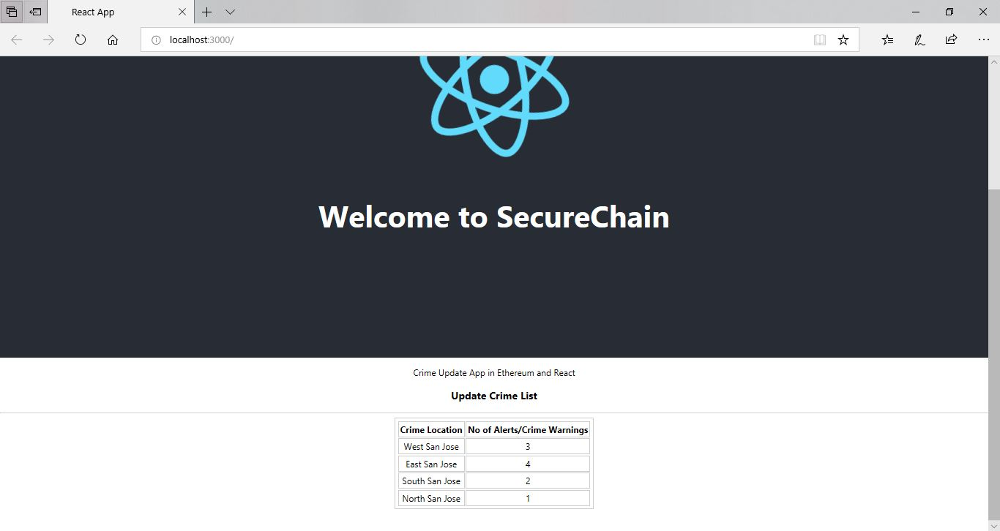

# Secure Chain Blockchain DApp 

Traveling around the world has been made easy nowadays. But do you know, there’s on average 1,088,300 (1 million) passengers and pedestrians coming across the US border everyday? That’s a huge amount of work to perform background for everybody in real time. Plus, since every security party has its own data center, it would be hard for a particular border in one particular country to identify a person with all their previous crime record in other countries. 

*With this great amount of cross border interactions, collaborations in data exchange among all parties has become more and more important.*

Obviously they cannot share a public database where every party has access to modify the crime record. So how could all the security parties safely exchange data, keep an immutable record, and preserves the ownership of the party origin?

*Meet Secure Chain, the first ever decentralized application that would help.* 

* With blockchain technology, it has the benefit of immutable crime record shared among all police station, border customs, and securities. 

* It is immutable and most importantly reliable. 

## Use Cases 
#### *So, who should join secure chain and how does it work?* 

* When a crime is committed, the security party that identified it would put one node onto the security chain, then, it updates the record in every other server. Just like adding a node and sync it in blockchain. 

* When a suspect is crossing the border, the custom will query the chain using the unique ID associated with his passport.. to retrieve a brief record of the suspect, or even to determine if his passport is a fake passport.,just like determining a fake coin in the cryptocurrency. You could also request the crime detailed from other parties from their database, but also maintain the ownership of the data. 

*Join SecureChain today, protect the community, and prevent any bad things from even starting to happen and we make a better world!*

### First Look - Secure Chain v.0
THe first version contains the  List of Locations where each of the nodes can update crime rates in teh area. The next version will be extended to include Crime details including suspects,exact GPS location, type of crime and so on.

